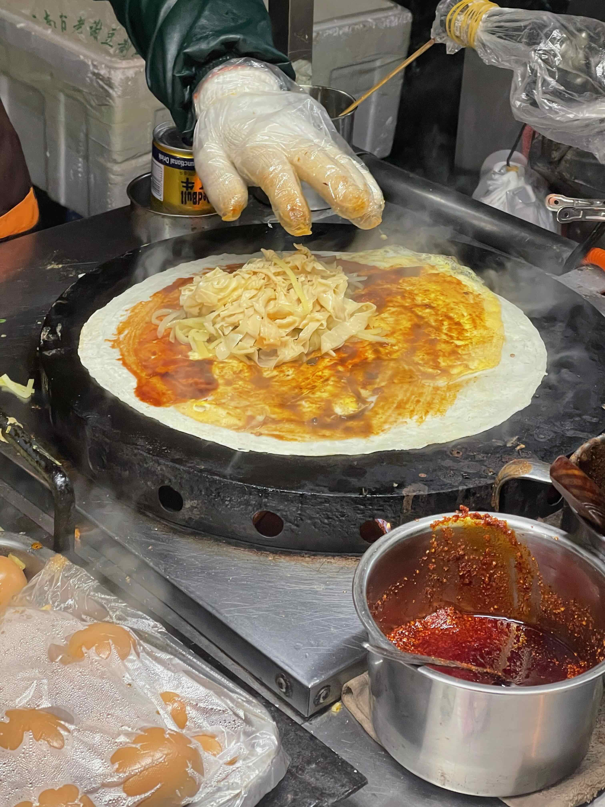
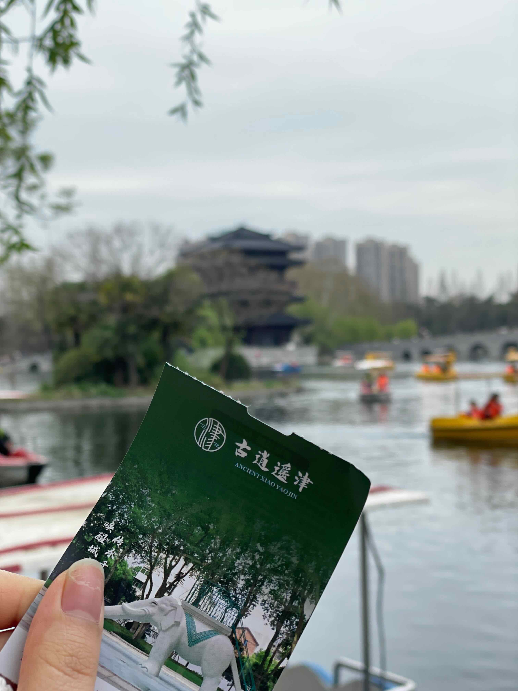

# 20230325合肥之旅

#### 20230325
**农大北门夜市小街**
首先来到了农大北门夜市小街,在这里我们吃了炸年糕 卷饼 温州瘦肉丸,在逛回来的时候又在年糕的摊位吃了火腿肠
熙熙攘攘的,人多但是不挤.本来想进农大的校园里面看一下的,但是都装了人脸识别的设备,遂作罢

卷饼,很好吃

#### 20230326
银泰(小喜越) 淮河路步行街(詹记芋泥雪贝还有蛋卷还有1块五两个的鸡蛋糕 卡旺卡) 古逍遥津(肉肠 划船) 步行街(蚵仔煎) 走路去红星路(老尤家烧饼 卡旺卡 甜嘟嘟 拿破仑蛋糕 奶酪饼干) 大唐国际步行街(铁板鱿鱼 萧县卷面皮) 回到小区门口吃炸炸

来淮河路步行街来一杯卡旺卡

古逍遥津

划游船

鸳鸯成双对

再来一杯卡旺卡

**甜嘟嘟的芝士饼干**

### 20230327
王如意(水洛馍 油茶)  杏花公园放风筝 国贸 卡旺卡两杯 巫氏三胖地锅鸡 官亭路小吃街(梅花糕) 走路回家 吃了煎饼打车

---

> 作者: 猫大人  
> URL: /20230325%E5%90%88%E8%82%A5%E4%B9%8B%E6%97%85/  

