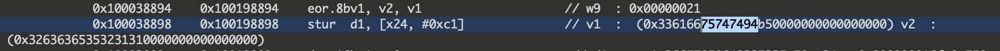

# 使用 LLDBTrace 还原算法


lldbtrace链接 https://github.com/yangyss/lldb-trace

### 首先利用 lldbtrace 处理一个BUG

有个经过 VMP 加固的结果一直不符合预期,大概定位一下位置
```
    memset(dest,0,0x10000);
    ByteToHexStr(dvChr,dest,dvChrLen);
    printf("进入前:%s\n",dest);
               
    byteTurn(dvChr, dvChrLen, 0x5);//字节翻转加密
    
    memset(dest2,0,0x10000);
    ByteToHexStr(dvChr,dest,dvChrLen);
    printf("进入后:%s\n",dest);
```
byteTurn函数的功能是对字节分别进行翻转,并加上一个值
```
//字节按位翻转 并加减随机值
void byteTurn(uint8_t *lpBuf,int lpLen,int seed){
    for (int i = 0; i < lpLen; i++) {
        uint8_t byte= lpBuf[i];
        lpBuf[i] = (((byte << 4) | (byte >> 4)) + seed) & 0xff;
    }
}
```


在 `byteTurn` 函数前后分别打印
进入前: `06 9c e7 0e 9c a6 d1 6d bd c8 77 a5 d1 68 bd cf`

WASM值:    `65 fe 03 e5 fe ff 02 db 00 01 7c ff 02 8b 00 01`
正&ensp;常&ensp;值:   `65 ce 83 e5 ce 6f 22 db e0 91 7c 5f 22 8b e0 01`

这里发现,部分字节经过翻转加密之后得出的结果和正常结果不一致

---
1. 对源码进行下断点调试,发现第一个BUG


这里汇编的大概意思是,取 var15 和 -4 进行比较,如果 var15 < -4 的话就跳转label14

但是在对照解释器时发现,两个值都被转成无符号int32进行比较:
```
    case I32LtS:
        c = (uint32_t) a < (uint32_t) b;
        break;
```
在无符号int32中, -4 会被转成 0xFFFFFFFC (4294967292),然后 var15 就会恒小于 0xFFFFFFFC的,这里显然是不合理的,所以这里应该改为有符号的比较
```
    case I32LtS:
        c =  (int32_t)a <  (int32_t)b;
        break;
```

---
2. 查找字节转换失败的原因

因为VMP解释器中流转非常复杂,进行断点调试难度还是比较大的,所以我这边采用使用lldbtrace先把大概的流程trace出来

在trace之前需要先确定一下 dvChr 的内存地址,这样比较容易定位一些

```
(lldb) p/x dvChr
(uint64_t) $16 = 0x0000000282634000
```

然后就可以打开trace,本来等待程序自己运行结束
但是运行了3小时,才产生了4w+行的日志,真机trace效率较低
感觉自己需要的部分应该差不多有了就结束了trace

###### 分析trace日志
首先搜索 dvChr 的内存地址进行一个基本的定位


发现结果才40条,不符合预期
因为这个加密函数是按位操作的,尝试内存位去掉一位,搜索 28263400 


这次有316条,基本接近了

简单分析一下日志,0x10026f274 这里是对内存赋值,也就是生成结果的位置


WASM值:    `65 fe 03 e5 fe ff 02 db 00 01 7c ff 02 8b 00 01`
符合我们的生成预期

因为第二个字节 9c => ce 时出错了, 转成 9c => fe,我们需要查看 282634001 的 0xfffffffe 是怎么生成的

尝试搜索 0xfffffffe 查看生成位置

定位到 0xfffffffe = 0xfffffff9 + 0x00000005,符合预期
继续向上查找 0xfffffff9 是怎么生成


这里可以看出  0xfffffff9 = 0xfffff9c0 | 0x0ffffff9
但是我们正常的运行逻辑应该是 0xc9 = 0xc0 | 0x09

继续查找 0x0ffffff9 的生成,最终定位在


错误原因:**ldrsb（功能不变指令变为带符号8位）,所以在高位自动补了0xffffff**
对应代码里的位置为
```
    case I32Load8U:
        stack[m->sp].value.int32 = *(int8_t*)maddr;
        stack[m->sp].value_type = I32;
        break;
```
这里做一下修改
```
    case I32Load8U:
        stack[m->sp].value.int32 = (*(int8_t*)maddr) & 0xff;
        stack[m->sp].value_type = I32;
        break;
```
对应的汇编指令


ldrb(功能不变，指令变为8位) 
这样子就恢复正常,解决了问题

---

### 还原阿里WAF算法

appkey:
`j0m4PjXNgOX_A_ZJXjBNgJ0DRtp_VQWwEMS5DkAJUJsKPR-0r8PqOkWMrhwymjZCoyOzBW2aqkrY8Tw9Cbwyl9fMOlOMPTC7_sOho2t_mOpdhkcQrWAc8fv_EATLX5DSrlve4QlMpMZtIuTfry6bm9BLY-_E9b9Kwmha6fZHAZY=`


=> `52cce52117575f24|14b8_d5bdfc94-fd29-4d22-8eef-c9b4af7b2db7|d330_c4857e5e-0b88-42de-9782-813d43b7cd56|m.yundun.waf.1|0002`

由hook得知AES的key和iv,从trace日志中查找生成算法
```
key = bytes.fromhex('42 36 03 c1 b2 8a b2 3a b7 53 25 97 87 12 5b 85')
iv =  bytes.fromhex('31 33 61 66 75 74 74 94 b5 16 1f 92 2d 47 9c b1')
```

#### KEY的生成
尝试搜索 423603c1 


发现
`0x423603c1b28ab23ab753259787125b85 = 0x512510d2a199a129a440368494014896 ^ 0x13131313131313131313131313131313
`
由hook得知 
`0x512510d2a199a129a440368494014896 = MD5(d5bdfc94-fd29-4d22-8eef-c9b4af7b2db7)`

查找 0x13131313131313131313131313131313 的生成

dup用于把一个相同值赋值若干次


查找 w8  : 0x00000013 的生成

0x00000013 = 0x0000000d + 0x00000006
0x0000000d 和 0x00000006 是 0xfffffe6d 个位和十位


查找 w8  : 0xfffffe6d 的生成
```
0xfffffe6d = 0xffffff96 + 0xfffffed7
0xfffffed7 = 0x00000048 + 0xfffffe8f
0xfffffe8f = 0x00000001 + 0xfffffe8e
0xfffffe8e = 0xffffff94 + 0xfffffefa
0xfffffefa = 0xffffff84 + 0xffffff76
....

```
发现是一个循环相加, 仔细看可以知道是 0x512510d2a199a129a440368494014896 的循环相加
写个简单的代码验证一下
```
    bytearray = bytes.fromhex('512510d2a199a129a440368494014896')
    ret = 0
    for key in bytearray:
        ret += int(key)
    print(hex(ret))
    
    ==> 0x66d 
```
尾数 0x6d 符合预期

#### IV 的生成
`iv =  bytes.fromhex('31 33 61 66 75 74 74 94 b5 16 1f 92 2d 47 9c b1')`

直接搜索 31336166 没有结果
顺位搜索后面四个字节 75747494

`0x33616675747494b50000000000000000 = 0x32636365353231310000000000000000 ^ 0x010205104146a5840000000000000000`


可得 0x010205104146a5840000000000000000 为固定值


    


<br><br><br><br><br><br><br><br>

---

> 作者: [mdr](https://github.com/mdr668)  
> URL: /%E4%BD%BF%E7%94%A8-lldbtrace-%E8%BF%98%E5%8E%9F%E7%AE%97%E6%B3%95/  

